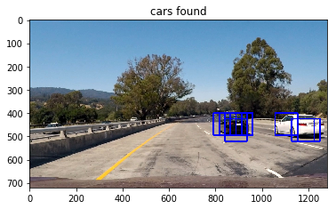
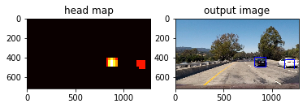
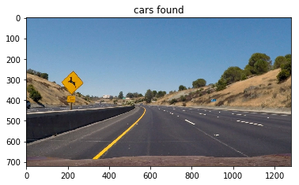
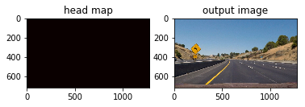
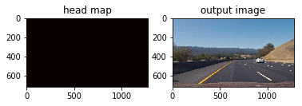

**Vehicle Detection Project**

The goals / steps of this project are the following:

* Perform a Histogram of Oriented Gradients (HOG) feature extraction on a labeled training set of images and train a classifier Linear SVM classifier
* Optionally, you can also apply a color transform and append binned color features, as well as histograms of color, to your HOG feature vector. 
* Note: for those first two steps don't forget to normalize your features and randomize a selection for training and testing.
* Implement a sliding-window technique and use your trained classifier to search for vehicles in images.
* Run your pipeline on a video stream (start with the test_video.mp4 and later implement on full project_video.mp4) and create a heat map of recurring detections frame by frame to reject outliers and follow detected vehicles.
* Estimate a bounding box for vehicles detected.

[//]: # (Image References)
[image1]: ./output_images/car_example.png
[image2]: ./output_images/non_car_example.png
[image3]: ./output_images/cars_found.png
[image4]: ./output_images/outputfigure.png
[image5]: ./output_images/HOG_out.png
[image6]: ./output_images/Notcar_HOG_out.png
[image7]: ./output_images/output_bboxes.png
[video1]: ./project_video_output.mp4

## [Rubric](https://review.udacity.com/#!/rubrics/513/view) Points
### Here I will consider the rubric points individually and describe how I addressed each point in my implementation.  


## Data Preparation

To train the classifier, I used the labeled data for vehicle and non-vehicle examples provided in the class, which is a combination of the GTI vehicle image database, the KITTI vision benchmark suite, and examples extracted from the project video itself. I used the SVM as a classifier, and trained it on my pc. To save computational time, I did not use all of the data but randomly chose 5000 examples out of the not-car examples and 4000 out of the car examples. Below are an example of the car and non-car images provided:

![alt text][image1]

![alt text][image2]

## Feature Extraction

I used a combined feature of hog features, spatial color features and color histogram features. The code for this step is contained under the file lesson_functions.py and in the function extract_features.


### Histogram of Oriented Gradients (HOG)

To compute the HOG of the images, I used the scikit-image library. The code for this step is contained under the file lesson_functions.py and in the function get_hog_features. As for the configuration, I used the following parameters:

orient = 9  # HOG orientations

pix_per_cell = 8 # HOG pixels per cell

cell_per_block = 2 # HOG cells per block

which is provided in the class and yield over 99% of accuracy in the trained SVM. As for the color space, I used the `YCrCb` color space. Here is an example using the `YCrCb` color space and HOG parameters of `orientations=9`, `pixels_per_cell=(8, 8)` and `cells_per_block=(2, 2)` on the non-car example:
![alt text][image5]
And here is an example of using the `YCrCb` color space and HOG parameters as described on a car example:
![alt text][image6]

I trained a linear SVM using the svm.SVC function in the scikit-learn library.The trained classifier yield an accuracy of 0.9922.

### Sliding Window Search


I decided to restrict my search to the area in the image where a car can be present (400 to 656 along the y-axis). The window size and overlap where the same as those used in the lesson since they worked well for detecting vehicles.
![alt text][image3]
Ultimately I searched on two scales using YCrCb 3-channel HOG features plus spatially binned color and histograms of color in the feature vector, which provided a nice result.  Here are some example images:
![alt text][image4]

### Video Implementation

The result of the vehicle detection pipleline is uploaded to this repository.
Here's a [link to my video result](./project_video_output.mp4)


I recorded the positions of positive detections in each frame of the video.  From the positive detections I created a heatmap and then thresholded that map to identify vehicle positions.  I then used `scipy.ndimage.measurements.label()` to identify individual blobs in the heatmap.  I then assumed each blob corresponded to a vehicle.  I constructed bounding boxes to cover the area of each blob detected.  


### Discussion


I noticed that in the video where two cars are very close, it is detected as a single but bigger car. To resolve this issue I would like to detect if the region which is hot in the heatmap has two hot centroids instead of one, signalling the presence of two vehicles. 

---


```python
import matplotlib.image as mpimg
import matplotlib.pyplot as plt
import numpy as np
import cv2
import glob
import time
import random
from sklearn.svm import LinearSVC
from sklearn.preprocessing import StandardScaler
from skimage.feature import hog
from sklearn.externals import joblib
from lesson_functions import *
from sklearn.model_selection import train_test_split
from scipy.ndimage.measurements import label
from collections import deque


```


```python

```

## Data Loading


```python
# Read in cars and notcars
images = glob.glob('./non-vehicles/*/*.png')
cars = []
notcars = []
noncars_list=random.sample(images, 5000)
for image in noncars_list:
    notcars.append(image)
print("number of non-car examples are:", len(notcars))

images = glob.glob('./vehicles/*/*.png')
cars_list=random.sample(images, 4000)
for image in cars_list:
        cars.append(image)
print("number of car examples are:", len(cars))

```

    number of non-car examples are: 5000
    number of car examples are: 4000
    

## Here is the beginning of the main_step


```python
color_space = 'YCrCb' # Can be RGB, HSV, LUV, HLS, YUV, YCrCb
orient = 9  # HOG orientations
pix_per_cell = 8 # HOG pixels per cell
cell_per_block = 2 # HOG cells per block
hog_channel = "ALL" # Can be 0, 1, 2, or "ALL"
spatial_size = (32, 32) # Spatial binning dimensions
hist_bins = 32    # Number of histogram bins
spatial_feat = True # Spatial features on or off
hist_feat = True # Histogram features on or off
hog_feat = True # HOG features on or off
ystart = 400 # Min and max in y to search in slide_window()
ystop = 656
scale = 1.5
heat_threshold=26
b_boxes_deque = deque(maxlen=30)

load_trained = True
car_features = extract_features(cars, color_space=color_space, 
                        spatial_size=spatial_size, hist_bins=hist_bins, 
                        orient=orient, pix_per_cell=pix_per_cell, 
                        cell_per_block=cell_per_block, 
                        hog_channel=hog_channel, spatial_feat=spatial_feat, 
                        hist_feat=hist_feat, hog_feat=hog_feat)
print ('car_features length: ', len(car_features))
notcar_features = extract_features(notcars, color_space=color_space, 
                        spatial_size=spatial_size, hist_bins=hist_bins, 
                        orient=orient, pix_per_cell=pix_per_cell, 
                        cell_per_block=cell_per_block, 
                        hog_channel=hog_channel, spatial_feat=spatial_feat, 
                        hist_feat=hist_feat, hog_feat=hog_feat)
print ('notcar_features length: ', len(notcar_features))
#print("not car features shape", notcar_features.shape)
X = np.vstack((car_features, notcar_features)).astype(np.float64) 
print("X shape", X.shape)
# Fit a per-column scaler
X_scaler = StandardScaler().fit(X)
# Apply the scaler to X
scaled_X = X_scaler.transform(X)

# Define the labels vector
y = np.hstack((np.ones(len(car_features)), np.zeros(len(notcar_features))))


# Split up data into randomized training and test sets
rand_state = np.random.randint(0, 100)
X_train, X_test, y_train, y_test = train_test_split(
    scaled_X, y, test_size=0.2, random_state=rand_state)

print('Using:',orient,'orientations',pix_per_cell,
    'pixels per cell and', cell_per_block,'cells per block')
print('Feature vector length:', len(X_train[0]))
print('Feature vector shape:', X_train.shape)
# Use a linear SVC 
if load_trained == True:
    svc, X_scaler = joblib.load('svc-model.pkl')
else:
    svc = LinearSVC()
    t=time.time()
    svc.fit(X_train, y_train)
    t2 = time.time()
    print(round(t2-t, 2), 'Seconds to train SVC...')
    joblib.dump((svc, X_scaler), 'svc-model.pkl')
# Check the training time for the SVC

# Check the score of the SVCX
print('Test Accuracy of SVC = ', round(svc.score(X_test, y_test), 4))
print(scaled_X.shape)
```

    C:\MyProgs\Conda\envs\carnd-term1\lib\site-packages\skimage\feature\_hog.py:119: skimage_deprecation: Default value of `block_norm`==`L1` is deprecated and will be changed to `L2-Hys` in v0.15
      'be changed to `L2-Hys` in v0.15', skimage_deprecation)
    

    car_features length:  4000
    notcar_features length:  5000
    X shape (9000, 8460)
    Using: 9 orientations 8 pixels per cell and 2 cells per block
    Feature vector length: 8460
    Feature vector shape: (7200, 8460)
    Test Accuracy of SVC =  0.9944
    (9000, 8460)
    

## Visualization


```python
print("1")
image_orig = mpimg.imread('.\output_images\car_example.png')
plt.figure()
plt.title("car example")
outfile = "car example.png"
plt.imshow(image_orig)
#plt.savefig(outfile)
imgYcrCb = cv2.cvtColor(image_orig, cv2.COLOR_RGB2YCrCb)
image_list=[]

for channel in range(3):
    features,hog_image = get_hog_features(imgYcrCb[:,:,channel], orient, pix_per_cell, 
                                          cell_per_block, vis=True, feature_vec=True)

    title = 'HOG channel %s' % (channel)
    plt.title(title)
    plt.imshow(hog_image,cmap='gray')
    outfile='Car_HOG_channel %s.png' % (channel)
    image_list.append(hog_image)
    #plt.savefig(outfile)
    plt.show()
    
image_orig = cv2.imread('.\output_images\car_example.png')
image = cv2.cvtColor(image_orig, cv2.COLOR_BGR2RGB)
channel1_hist, channel2_hist, channel3_hist, bin_centers = color_hist(image, vis=True)
# Plot the examples
fig = plt.figure(figsize=(12,3));

plt.subplot(141)
plt.imshow(image)
plt.title('Original Image', fontsize=15)
plt.subplot(142)
plt.bar(bin_centers, channel1_hist[0])
plt.xlim(0, 256)
plt.ylim(0, 800)
plt.title('R Histogram', fontsize=15);
plt.subplot(143)
plt.bar(bin_centers, channel2_hist[0])
plt.xlim(0, 256)
plt.ylim(0, 800)
plt.title('G Histogram', fontsize=15);
plt.subplot(144)
plt.bar(bin_centers, channel3_hist[0])
plt.xlim(0, 256)
plt.ylim(0, 800)
plt.title('B Histogram', fontsize=15);
plt.show()
plt.savefig('output_images/color_hist_vis.png', 
            bbox_inches="tight")    
    
    
    
plt.figure()
plt.subplot(131)
plt.title("HOG Channel 0")
plt.imshow(image_list[0], cmap='gray')
plt.subplot(132)
plt.title("HOG Channel 1")
plt.imshow(image_list[1], cmap='gray')
plt.subplot(133)
plt.title("HOG Channel 2")
plt.imshow(image_list[2], cmap='gray')
plt.savefig("HOG_out.png")
plt.show()   
    
    
image_list=[] 
image = mpimg.imread('.\output_images\non_car_example.png')
img = cv2.cvtColor(image, cv2.COLOR_RGB2YCrCb)
plt.figure()
plt.title("non-car example")
outfile = "non-car example.png"
plt.imshow(image)
#plt.savefig(outfile)
for channel in range(3):
    features,hog_image = get_hog_features(img[:,:,channel], orient, pix_per_cell, 
                                          cell_per_block, vis=True, feature_vec=True)

    title = 'HOG channel %s' % (channel)
    plt.title(title)
    plt.imshow(hog_image,cmap='gray')
    outfile='Not_Car_HOGchannel %s.png' % (channel)
    image_list.append(hog_image)
    #plt.savefig(outfile)
    plt.show()

plt.figure()
plt.subplot(131)
plt.title("HOG Channel 0")
plt.imshow(image_list[0], cmap='gray')
plt.subplot(132)
plt.title("HOG Channel 1")
plt.imshow(image_list[1], cmap='gray')
plt.subplot(133)
plt.title("HOG Channel 2")
plt.imshow(image_list[2], cmap='gray')
plt.savefig("Notcar_HOG_out.png")
plt.show()   
    

test_images = glob.glob('test_images/*.jpg')
i=0
for image in test_images:
    img = mpimg.imread(image)
    b_boxes = find_cars(img, ystart, ystop, scale, svc, X_scaler, orient, pix_per_cell, cell_per_block, spatial_size, hist_bins)
    result = draw_boxes(img, b_boxes)
    plt.figure()
    plt.title("cars found")
    outfile = 'cars_with_boxes%s.png' % (i)
    plt.imshow(result)
    plt.show()
    #plt.savefig(outfile)
    i=i+1
   
    heat = np.zeros_like(img[:,:,0]).astype(np.float)

    add_heat(heat, b_boxes)

    heat = apply_threshold(heat,1)

    heatmap = np.clip(heat, 0, 255)

    labels = label(heatmap)
    draw_img = draw_labeled_bboxes(np.copy(img), labels)
    
    plt.figure()
    plt.subplot(121)
    plt.title("head map")
    plt.imshow(heat, cmap='hot')
    plt.subplot(122)
    plt.title("output image")
    plt.imshow(draw_img)
    outfile = 'outputfigure %s.png' % (i)
    #plt.savefig(outfile)
    plt.show()
    i=i+1

```

    1
    














    <matplotlib.figure.Figure at 0x1d4ac30fd30>





    ---------------------------------------------------------------------------

    OSError                                   Traceback (most recent call last)

    <ipython-input-14-8dcf48029cbb> in <module>()
         66 
         67 image_list=[]
    ---> 68 image = mpimg.imread('.\output_images\non_car_example.png')
         69 img = cv2.cvtColor(image, cv2.COLOR_RGB2YCrCb)
         70 plt.figure()
    

    C:\MyProgs\Conda\envs\carnd-term1\lib\site-packages\matplotlib\image.py in imread(fname, format)
       1244             return handler(fd)
       1245         else:
    -> 1246             with open(fname, 'rb') as fd:
       1247                 return handler(fd)
       1248     else:
    

    OSError: [Errno 22] Invalid argument: '.\\output_images\non_car_example.png'


## Video Processing 


```python


def pipeline(image):
 
    b_boxes = find_cars(image, ystart, ystop, scale, svc, X_scaler, orient, pix_per_cell, cell_per_block, spatial_size, hist_bins)
    b_boxes_deque.append(b_boxes)

    heat = np.zeros_like(image[:,:,0]).astype(np.float)
    # Add heat to each box in box list
    add_heat_video(heat, b_boxes_deque)

    # Apply threshold to help remove false positives
    heat = apply_threshold(heat, heat_threshold)

    # Visualize the heatmap when displaying
    heatmap = np.clip(heat, 0, 255)

    # Find final boxes from heatmap using label function
    labels = label(heatmap)
    result = draw_labeled_bboxes(np.copy(image), labels)

    return result
```


```python
from moviepy.editor import VideoFileClip
from IPython.display import HTML


output_clip = 'test_video_out.mp4'

#clip1 = VideoFileClip("test_video.mp4")
clip1 = VideoFileClip("test_video.mp4")
vehicle_detect = clip1.fl_image(pipeline)
%time vehicle_detect.write_videofile(output_clip, audio=False)

```

    [MoviePy] >>>> Building video test_video_out.mp4
    [MoviePy] Writing video test_video_out.mp4
    

     64%|██████████████████████████████████████████████▏                         | 25/39 [00:14<00:08,  1.74it/s]


    ---------------------------------------------------------------------------

    KeyboardInterrupt                         Traceback (most recent call last)

    <timed eval> in <module>()
    

    <decorator-gen-176> in write_videofile(self, filename, fps, codec, bitrate, audio, audio_fps, preset, audio_nbytes, audio_codec, audio_bitrate, audio_bufsize, temp_audiofile, rewrite_audio, remove_temp, write_logfile, verbose, threads, ffmpeg_params, progress_bar)
    

    C:\MyProgs\Conda\envs\carnd-term1\lib\site-packages\moviepy\decorators.py in requires_duration(f, clip, *a, **k)
         52         raise ValueError("Attribute 'duration' not set")
         53     else:
    ---> 54         return f(clip, *a, **k)
         55 
         56 
    

    <decorator-gen-175> in write_videofile(self, filename, fps, codec, bitrate, audio, audio_fps, preset, audio_nbytes, audio_codec, audio_bitrate, audio_bufsize, temp_audiofile, rewrite_audio, remove_temp, write_logfile, verbose, threads, ffmpeg_params, progress_bar)
    

    C:\MyProgs\Conda\envs\carnd-term1\lib\site-packages\moviepy\decorators.py in use_clip_fps_by_default(f, clip, *a, **k)
        135              for (k,v) in k.items()}
        136 
    --> 137     return f(clip, *new_a, **new_kw)
    

    <decorator-gen-174> in write_videofile(self, filename, fps, codec, bitrate, audio, audio_fps, preset, audio_nbytes, audio_codec, audio_bitrate, audio_bufsize, temp_audiofile, rewrite_audio, remove_temp, write_logfile, verbose, threads, ffmpeg_params, progress_bar)
    

    C:\MyProgs\Conda\envs\carnd-term1\lib\site-packages\moviepy\decorators.py in convert_masks_to_RGB(f, clip, *a, **k)
         20     if clip.ismask:
         21         clip = clip.to_RGB()
    ---> 22     return f(clip, *a, **k)
         23 
         24 @decorator.decorator
    

    C:\MyProgs\Conda\envs\carnd-term1\lib\site-packages\moviepy\video\VideoClip.py in write_videofile(self, filename, fps, codec, bitrate, audio, audio_fps, preset, audio_nbytes, audio_codec, audio_bitrate, audio_bufsize, temp_audiofile, rewrite_audio, remove_temp, write_logfile, verbose, threads, ffmpeg_params, progress_bar)
        347                            verbose=verbose, threads=threads,
        348                            ffmpeg_params=ffmpeg_params,
    --> 349                            progress_bar=progress_bar)
        350 
        351         if remove_temp and make_audio:
    

    C:\MyProgs\Conda\envs\carnd-term1\lib\site-packages\moviepy\video\io\ffmpeg_writer.py in ffmpeg_write_video(clip, filename, fps, codec, bitrate, preset, withmask, write_logfile, audiofile, verbose, threads, ffmpeg_params, progress_bar)
        207 
        208     for t,frame in clip.iter_frames(progress_bar=progress_bar, with_times=True,
    --> 209                                     fps=fps, dtype="uint8"):
        210         if withmask:
        211             mask = (255*clip.mask.get_frame(t))
    

    C:\MyProgs\Conda\envs\carnd-term1\lib\site-packages\tqdm\_tqdm.py in __iter__(self)
        831 """, fp_write=getattr(self.fp, 'write', sys.stderr.write))
        832 
    --> 833             for obj in iterable:
        834                 yield obj
        835                 # Update and print the progressbar.
    

    C:\MyProgs\Conda\envs\carnd-term1\lib\site-packages\moviepy\Clip.py in generator()
        473         def generator():
        474             for t in np.arange(0, self.duration, 1.0/fps):
    --> 475                 frame = self.get_frame(t)
        476                 if (dtype is not None) and (frame.dtype != dtype):
        477                     frame = frame.astype(dtype)
    

    <decorator-gen-139> in get_frame(self, t)
    

    C:\MyProgs\Conda\envs\carnd-term1\lib\site-packages\moviepy\decorators.py in wrapper(f, *a, **kw)
         87         new_kw = {k: fun(v) if k in varnames else v
         88                  for (k,v) in kw.items()}
    ---> 89         return f(*new_a, **new_kw)
         90     return decorator.decorator(wrapper)
         91 
    

    C:\MyProgs\Conda\envs\carnd-term1\lib\site-packages\moviepy\Clip.py in get_frame(self, t)
         93                 return frame
         94         else:
    ---> 95             return self.make_frame(t)
         96 
         97     def fl(self, fun, apply_to=[], keep_duration=True):
    

    C:\MyProgs\Conda\envs\carnd-term1\lib\site-packages\moviepy\Clip.py in <lambda>(t)
        134 
        135         #mf = copy(self.make_frame)
    --> 136         newclip = self.set_make_frame(lambda t: fun(self.get_frame, t))
        137 
        138         if not keep_duration:
    

    C:\MyProgs\Conda\envs\carnd-term1\lib\site-packages\moviepy\video\VideoClip.py in <lambda>(gf, t)
        531         `get_frame(t)` by another frame,  `image_func(get_frame(t))`
        532         """
    --> 533         return self.fl(lambda gf, t: image_func(gf(t)), apply_to)
        534 
        535     # --------------------------------------------------------------
    

    <ipython-input-7-2a23f134e173> in pipeline(image)
          3 def pipeline(image):
          4 
    ----> 5     b_boxes = find_cars(image, ystart, ystop, scale, svc, X_scaler, orient, pix_per_cell, cell_per_block, spatial_size, hist_bins)
          6     b_boxes_deque.append(b_boxes)
          7 
    

    C:\Udacity\CarND-Vehicle-Detection\lesson_functions.py in find_cars(img, ystart, ystop, scale, svc, X_scaler, orient, pix_per_cell, cell_per_block, spatial_size, hist_bins)
        187     hog1 = get_hog_features(ch1, orient, pix_per_cell, cell_per_block, feature_vec=False)
        188     hog2 = get_hog_features(ch2, orient, pix_per_cell, cell_per_block, feature_vec=False)
    --> 189     hog3 = get_hog_features(ch3, orient, pix_per_cell, cell_per_block, feature_vec=False)
        190 
        191     b_boxes = []
    

    C:\Udacity\CarND-Vehicle-Detection\lesson_functions.py in get_hog_features(img, orient, pix_per_cell, cell_per_block, vis, feature_vec)
         40                        cells_per_block=(cell_per_block, cell_per_block),
         41                        transform_sqrt=True,
    ---> 42                        visualise=vis, feature_vector=feature_vec)
         43         return features
         44 
    

    C:\MyProgs\Conda\envs\carnd-term1\lib\site-packages\skimage\feature\_hog.py in hog(image, orientations, pixels_per_cell, cells_per_block, block_norm, visualise, transform_sqrt, feature_vector, normalise)
        235             block = orientation_histogram[y:y + by, x:x + bx, :]
        236             normalized_blocks[y, x, :] = \
    --> 237                 _hog_normalize_block(block, method=block_norm)
        238 
        239     """
    

    KeyboardInterrupt: 


```python
output_clip = 'project_video_output.mp4'

#clip1 = VideoFileClip("test_video.mp4")
clip1 = VideoFileClip("project_video.mp4")
vehicle_detect = clip1.fl_image(pipeline)
%time vehicle_detect.write_videofile(output_clip, audio=False)
```

    [MoviePy] >>>> Building video project_video_output.mp4
    [MoviePy] Writing video project_video_output.mp4
    

    
      0%|                                                                               | 0/1261 [00:00<?, ?it/s]
      0%|                                                                       | 1/1261 [00:00<12:04,  1.74it/s]
      0%|                                                                       | 2/1261 [00:01<12:23,  1.69it/s]
      0%|▏                                                                      | 3/1261 [00:01<12:12,  1.72it/s]
      0%|▏                                                                      | 4/1261 [00:02<12:00,  1.75it/s]
      0%|▎                                                                      | 5/1261 [00:02<11:56,  1.75it/s]
      0%|▎                                                                      | 6/1261 [00:03<11:51,  1.76it/s]
      1%|▍                                                                      | 7/1261 [00:04<11:49,  1.77it/s]
      1%|▍                                                                      | 8/1261 [00:04<11:43,  1.78it/s]
      1%|▌                                                                      | 9/1261 [00:05<11:45,  1.77it/s]
      1%|▌                                                                     | 10/1261 [00:05<11:52,  1.76it/s]
      1%|▌                                                                     | 11/1261 [00:06<11:50,  1.76it/s]
      1%|▋                                                                     | 12/1261 [00:06<11:59,  1.74it/s]
      1%|▋                                                                     | 13/1261 [00:07<11:49,  1.76it/s]
      1%|▊                                                                     | 14/1261 [00:08<11:56,  1.74it/s]
      1%|▊                                                                     | 15/1261 [00:08<11:51,  1.75it/s]
      1%|▉                                                                     | 16/1261 [00:09<12:02,  1.72it/s]
      1%|▉                                                                     | 17/1261 [00:09<12:07,  1.71it/s]
      1%|▉                                                                     | 18/1261 [00:10<11:55,  1.74it/s]
      2%|█                                                                     | 19/1261 [00:10<11:52,  1.74it/s]
      2%|█                                                                     | 20/1261 [00:11<11:45,  1.76it/s]
      2%|█▏                                                                    | 21/1261 [00:12<11:56,  1.73it/s]
      2%|█▏                                                                    | 22/1261 [00:12<12:05,  1.71it/s]
      2%|█▎                                                                    | 23/1261 [00:13<12:18,  1.68it/s]
      2%|█▎                                                                    | 24/1261 [00:13<12:36,  1.63it/s]
      2%|█▍                                                                    | 25/1261 [00:14<12:30,  1.65it/s]
      2%|█▍                                                                    | 26/1261 [00:15<12:32,  1.64it/s]
      2%|█▍                                                                    | 27/1261 [00:15<12:12,  1.68it/s]
      2%|█▌                                                                    | 28/1261 [00:16<11:57,  1.72it/s]
      2%|█▌                                                                    | 29/1261 [00:16<11:38,  1.76it/s]
      2%|█▋                                                                    | 30/1261 [00:17<11:29,  1.79it/s]
      2%|█▋                                                                    | 31/1261 [00:17<11:33,  1.77it/s]
      3%|█▊                                                                    | 32/1261 [00:18<11:27,  1.79it/s]
      3%|█▊                                                                    | 33/1261 [00:18<11:16,  1.82it/s]
      3%|█▉                                                                    | 34/1261 [00:19<11:22,  1.80it/s]
      3%|█▉                                                                    | 35/1261 [00:20<11:21,  1.80it/s]
      3%|█▉                                                                    | 36/1261 [00:20<11:21,  1.80it/s]
      3%|██                                                                    | 37/1261 [00:21<11:14,  1.81it/s]
      3%|██                                                                    | 38/1261 [00:21<11:18,  1.80it/s]
      3%|██▏                                                                   | 39/1261 [00:22<11:17,  1.80it/s]
      3%|██▏                                                                   | 40/1261 [00:22<11:07,  1.83it/s]
      3%|██▎                                                                   | 41/1261 [00:23<11:05,  1.83it/s]
      3%|██▎                                                                   | 42/1261 [00:23<11:03,  1.84it/s]
      3%|██▍                                                                   | 43/1261 [00:24<11:02,  1.84it/s]
      3%|██▍                                                                   | 44/1261 [00:25<11:05,  1.83it/s]
      4%|██▍                                                                   | 45/1261 [00:25<11:10,  1.81it/s]
      4%|██▌                                                                   | 46/1261 [00:26<11:20,  1.79it/s]
      4%|██▌                                                                   | 47/1261 [00:26<11:15,  1.80it/s]
      4%|██▋                                                                   | 48/1261 [00:27<11:16,  1.79it/s]
      4%|██▋                                                                   | 49/1261 [00:27<11:14,  1.80it/s]
      4%|██▊                                                                   | 50/1261 [00:28<11:05,  1.82it/s]
      4%|██▊                                                                   | 51/1261 [00:28<10:59,  1.84it/s]
      4%|██▉                                                                   | 52/1261 [00:29<10:54,  1.85it/s]
      4%|██▉                                                                   | 53/1261 [00:29<11:06,  1.81it/s]
      4%|██▉                                                                   | 54/1261 [00:30<11:02,  1.82it/s]
      4%|███                                                                   | 55/1261 [00:31<11:00,  1.83it/s]
      4%|███                                                                   | 56/1261 [00:31<11:02,  1.82it/s]
      5%|███▏                                                                  | 57/1261 [00:32<10:56,  1.83it/s]
      5%|███▏                                                                  | 58/1261 [00:32<10:55,  1.84it/s]
      5%|███▎                                                                  | 59/1261 [00:33<11:06,  1.80it/s]
      5%|███▎                                                                  | 60/1261 [00:33<11:03,  1.81it/s]
      5%|███▍                                                                  | 61/1261 [00:34<11:02,  1.81it/s]
      5%|███▍                                                                  | 62/1261 [00:34<11:01,  1.81it/s]
      5%|███▍                                                                  | 63/1261 [00:35<10:56,  1.82it/s]
      5%|███▌                                                                  | 64/1261 [00:36<11:04,  1.80it/s]
      5%|███▌                                                                  | 65/1261 [00:36<11:09,  1.79it/s]
      5%|███▋                                                                  | 66/1261 [00:37<11:07,  1.79it/s]
      5%|███▋                                                                  | 67/1261 [00:37<11:08,  1.79it/s]
      5%|███▊                                                                  | 68/1261 [00:38<10:58,  1.81it/s]
      5%|███▊                                                                  | 69/1261 [00:38<11:00,  1.80it/s]
      6%|███▉                                                                  | 70/1261 [00:39<11:00,  1.80it/s]
      6%|███▉                                                                  | 71/1261 [00:39<10:58,  1.81it/s]
      6%|███▉                                                                  | 72/1261 [00:40<10:59,  1.80it/s]
      6%|████                                                                  | 73/1261 [00:41<10:55,  1.81it/s]
      6%|████                                                                  | 74/1261 [00:41<11:08,  1.78it/s]
      6%|████▏                                                                 | 75/1261 [00:42<11:03,  1.79it/s]
      6%|████▏                                                                 | 76/1261 [00:42<10:53,  1.81it/s]
      6%|████▎                                                                 | 77/1261 [00:43<11:10,  1.77it/s]
      6%|████▎                                                                 | 78/1261 [00:43<11:17,  1.75it/s]
      6%|████▍                                                                 | 79/1261 [00:44<11:35,  1.70it/s]
      6%|████▍                                                                 | 80/1261 [00:45<11:43,  1.68it/s]
      6%|████▍                                                                 | 81/1261 [00:45<11:43,  1.68it/s]
      7%|████▌                                                                 | 82/1261 [00:46<11:32,  1.70it/s]
      7%|████▌                                                                 | 83/1261 [00:46<11:07,  1.77it/s]
      7%|████▋                                                                 | 84/1261 [00:47<11:06,  1.77it/s]
      7%|████▋                                                                 | 85/1261 [00:47<10:58,  1.79it/s]
      7%|████▊                                                                 | 86/1261 [00:48<10:57,  1.79it/s]
      7%|████▊                                                                 | 87/1261 [00:49<11:04,  1.77it/s]
      7%|████▉                                                                 | 88/1261 [00:49<11:02,  1.77it/s]
      7%|████▉                                                                 | 89/1261 [00:50<10:48,  1.81it/s]
      7%|████▉                                                                 | 90/1261 [00:50<11:01,  1.77it/s]
      7%|█████                                                                 | 91/1261 [00:51<11:04,  1.76it/s]
      7%|█████                                                                 | 92/1261 [00:51<10:55,  1.78it/s]
      7%|█████▏                                                                | 93/1261 [00:52<10:40,  1.82it/s]
      7%|█████▏                                                                | 94/1261 [00:52<10:38,  1.83it/s]
      8%|█████▎                                                                | 95/1261 [00:53<10:45,  1.81it/s]
      8%|█████▎                                                                | 96/1261 [00:54<10:36,  1.83it/s]
      8%|█████▍                                                                | 97/1261 [00:54<10:32,  1.84it/s]
      8%|█████▍                                                                | 98/1261 [00:55<10:29,  1.85it/s]
      8%|█████▍                                                                | 99/1261 [00:55<10:31,  1.84it/s]
      8%|█████▍                                                               | 100/1261 [00:56<10:32,  1.84it/s]
      8%|█████▌                                                               | 101/1261 [00:56<10:25,  1.85it/s]
      8%|█████▌                                                               | 102/1261 [00:57<10:27,  1.85it/s]
      8%|█████▋                                                               | 103/1261 [00:57<10:29,  1.84it/s]
      8%|█████▋                                                               | 104/1261 [00:58<10:26,  1.85it/s]
      8%|█████▋                                                               | 105/1261 [00:58<10:19,  1.87it/s]
      8%|█████▊                                                               | 106/1261 [00:59<10:19,  1.86it/s]
      8%|█████▊                                                               | 107/1261 [00:59<10:22,  1.85it/s]
      9%|█████▉                                                               | 108/1261 [01:00<10:28,  1.83it/s]
      9%|█████▉                                                               | 109/1261 [01:01<10:26,  1.84it/s]
      9%|██████                                                               | 110/1261 [01:01<10:32,  1.82it/s]
      9%|██████                                                               | 111/1261 [01:02<10:37,  1.80it/s]
      9%|██████▏                                                              | 112/1261 [01:02<10:48,  1.77it/s]
      9%|██████▏                                                              | 113/1261 [01:03<11:00,  1.74it/s]
      9%|██████▏                                                              | 114/1261 [01:03<11:08,  1.72it/s]
      9%|██████▎                                                              | 115/1261 [01:04<11:05,  1.72it/s]
      9%|██████▎                                                              | 116/1261 [01:05<11:16,  1.69it/s]
      9%|██████▍                                                              | 117/1261 [01:05<11:25,  1.67it/s]
      9%|██████▍                                                              | 118/1261 [01:06<11:22,  1.68it/s]
      9%|██████▌                                                              | 119/1261 [01:06<11:25,  1.67it/s]
     10%|██████▌                                                              | 120/1261 [01:07<11:14,  1.69it/s]
     10%|██████▌                                                              | 121/1261 [01:08<10:59,  1.73it/s]
     10%|██████▋                                                              | 122/1261 [01:08<10:52,  1.75it/s]
     10%|██████▋                                                              | 123/1261 [01:09<10:38,  1.78it/s]
     10%|██████▊                                                              | 124/1261 [01:09<10:34,  1.79it/s]
     10%|██████▊                                                              | 125/1261 [01:10<10:38,  1.78it/s]
     10%|██████▉                                                              | 126/1261 [01:10<10:46,  1.76it/s]
     10%|██████▉                                                              | 127/1261 [01:11<10:54,  1.73it/s]
     10%|███████                                                              | 128/1261 [01:12<10:51,  1.74it/s]
     10%|███████                                                              | 129/1261 [01:12<10:43,  1.76it/s]
     10%|███████                                                              | 130/1261 [01:13<11:08,  1.69it/s]
     10%|███████▏                                                             | 131/1261 [01:13<10:47,  1.75it/s]
     10%|███████▏                                                             | 132/1261 [01:14<10:33,  1.78it/s]
     11%|███████▎                                                             | 133/1261 [01:14<10:30,  1.79it/s]
     11%|███████▎                                                             | 134/1261 [01:15<10:26,  1.80it/s]
     11%|███████▍                                                             | 135/1261 [01:15<10:20,  1.81it/s]
     11%|███████▍                                                             | 136/1261 [01:16<10:14,  1.83it/s]
     11%|███████▍                                                             | 137/1261 [01:17<10:15,  1.83it/s]
     11%|███████▌                                                             | 138/1261 [01:17<10:06,  1.85it/s]
     11%|███████▌                                                             | 139/1261 [01:18<10:11,  1.84it/s]
     11%|███████▋                                                             | 140/1261 [01:18<10:17,  1.82it/s]
     11%|███████▋                                                             | 141/1261 [01:19<10:15,  1.82it/s]
     11%|███████▊                                                             | 142/1261 [01:19<10:15,  1.82it/s]
     11%|███████▊                                                             | 143/1261 [01:20<10:11,  1.83it/s]
     11%|███████▉                                                             | 144/1261 [01:20<10:11,  1.83it/s]
     11%|███████▉                                                             | 145/1261 [01:21<10:10,  1.83it/s]
     12%|███████▉                                                             | 146/1261 [01:22<10:14,  1.81it/s]
     12%|████████                                                             | 147/1261 [01:22<10:14,  1.81it/s]
     12%|████████                                                             | 148/1261 [01:23<10:25,  1.78it/s]
     12%|████████▏                                                            | 149/1261 [01:23<10:23,  1.78it/s]
     12%|████████▏                                                            | 150/1261 [01:24<10:21,  1.79it/s]
     12%|████████▎                                                            | 151/1261 [01:24<10:26,  1.77it/s]
     12%|████████▎                                                            | 152/1261 [01:25<10:19,  1.79it/s]
     12%|████████▎                                                            | 153/1261 [01:25<10:22,  1.78it/s]
     12%|████████▍                                                            | 154/1261 [01:26<10:06,  1.82it/s]
     12%|████████▍                                                            | 155/1261 [01:27<10:06,  1.82it/s]
     12%|████████▌                                                            | 156/1261 [01:27<09:59,  1.84it/s]
     12%|████████▌                                                            | 157/1261 [01:28<10:02,  1.83it/s]
     13%|████████▋                                                            | 158/1261 [01:28<10:06,  1.82it/s]
     13%|████████▋                                                            | 159/1261 [01:29<10:10,  1.80it/s]
     13%|████████▊                                                            | 160/1261 [01:29<10:17,  1.78it/s]
     13%|████████▊                                                            | 161/1261 [01:30<10:18,  1.78it/s]
     13%|████████▊                                                            | 162/1261 [01:30<10:28,  1.75it/s]
     13%|████████▉                                                            | 163/1261 [01:31<10:27,  1.75it/s]
     13%|████████▉                                                            | 164/1261 [01:32<10:18,  1.77it/s]
     13%|█████████                                                            | 165/1261 [01:32<10:17,  1.77it/s]
     13%|█████████                                                            | 166/1261 [01:33<10:16,  1.77it/s]
     13%|█████████▏                                                           | 167/1261 [01:33<10:17,  1.77it/s]
     13%|█████████▏                                                           | 168/1261 [01:34<10:04,  1.81it/s]
     13%|█████████▏                                                           | 169/1261 [01:34<10:00,  1.82it/s]
     13%|█████████▎                                                           | 170/1261 [01:35<10:07,  1.79it/s]
     14%|█████████▎                                                           | 171/1261 [01:35<10:01,  1.81it/s]
     14%|█████████▍                                                           | 172/1261 [01:36<09:59,  1.82it/s]
     14%|█████████▍                                                           | 173/1261 [01:37<10:03,  1.80it/s]
     14%|█████████▌                                                           | 174/1261 [01:37<10:07,  1.79it/s]
     14%|█████████▌                                                           | 175/1261 [01:38<10:19,  1.75it/s]
     14%|█████████▋                                                           | 176/1261 [01:38<10:17,  1.76it/s]
     14%|█████████▋                                                           | 177/1261 [01:39<10:18,  1.75it/s]
     14%|█████████▋                                                           | 178/1261 [01:39<10:18,  1.75it/s]
     14%|█████████▊                                                           | 179/1261 [01:40<10:17,  1.75it/s]
     14%|█████████▊                                                           | 180/1261 [01:41<10:12,  1.76it/s]
     14%|█████████▉                                                           | 181/1261 [01:41<10:21,  1.74it/s]
     14%|█████████▉                                                           | 182/1261 [01:42<10:17,  1.75it/s]
     15%|██████████                                                           | 183/1261 [01:42<10:19,  1.74it/s]
     15%|██████████                                                           | 184/1261 [01:43<10:08,  1.77it/s]
     15%|██████████                                                           | 185/1261 [01:43<10:10,  1.76it/s]
     15%|██████████▏                                                          | 186/1261 [01:44<10:15,  1.75it/s]
     15%|██████████▏                                                          | 187/1261 [01:45<10:19,  1.73it/s]
     15%|██████████▎                                                          | 188/1261 [01:45<10:11,  1.76it/s]
     15%|██████████▎                                                          | 189/1261 [01:46<10:07,  1.76it/s]
     15%|██████████▍                                                          | 190/1261 [01:46<10:14,  1.74it/s]
     15%|██████████▍                                                          | 191/1261 [01:47<10:03,  1.77it/s]
     15%|██████████▌                                                          | 192/1261 [01:47<10:03,  1.77it/s]
     15%|██████████▌                                                          | 193/1261 [01:48<10:04,  1.77it/s]
     15%|██████████▌                                                          | 194/1261 [01:49<10:05,  1.76it/s]
     15%|██████████▋                                                          | 195/1261 [01:49<10:05,  1.76it/s]
     16%|██████████▋                                                          | 196/1261 [01:50<10:07,  1.75it/s]
     16%|██████████▊                                                          | 197/1261 [01:50<10:04,  1.76it/s]
     16%|██████████▊                                                          | 198/1261 [01:51<10:02,  1.76it/s]
     16%|██████████▉                                                          | 199/1261 [01:51<10:05,  1.75it/s]
     16%|██████████▉                                                          | 200/1261 [01:52<09:58,  1.77it/s]
     16%|██████████▉                                                          | 201/1261 [01:52<09:50,  1.80it/s]
     16%|███████████                                                          | 202/1261 [01:53<09:54,  1.78it/s]
     16%|███████████                                                          | 203/1261 [01:54<09:53,  1.78it/s]
     16%|███████████▏                                                         | 204/1261 [01:54<10:01,  1.76it/s]
     16%|███████████▏                                                         | 205/1261 [01:55<09:53,  1.78it/s]
     16%|███████████▎                                                         | 206/1261 [01:55<09:59,  1.76it/s]
     16%|███████████▎                                                         | 207/1261 [01:56<09:57,  1.76it/s]
     16%|███████████▍                                                         | 208/1261 [01:56<10:02,  1.75it/s]
     17%|███████████▍                                                         | 209/1261 [01:57<09:55,  1.77it/s]
     17%|███████████▍                                                         | 210/1261 [01:58<09:59,  1.75it/s]
     17%|███████████▌                                                         | 211/1261 [01:58<09:52,  1.77it/s]
     17%|███████████▌                                                         | 212/1261 [01:59<09:49,  1.78it/s]
     17%|███████████▋                                                         | 213/1261 [01:59<09:43,  1.80it/s]
     17%|███████████▋                                                         | 214/1261 [02:00<09:52,  1.77it/s]
     17%|███████████▊                                                         | 215/1261 [02:00<09:50,  1.77it/s]
     17%|███████████▊                                                         | 216/1261 [02:01<09:54,  1.76it/s]
     17%|███████████▊                                                         | 217/1261 [02:02<10:03,  1.73it/s]
     17%|███████████▉                                                         | 218/1261 [02:02<09:56,  1.75it/s]
     17%|███████████▉                                                         | 219/1261 [02:03<09:47,  1.77it/s]
     17%|████████████                                                         | 220/1261 [02:03<09:48,  1.77it/s]
     18%|████████████                                                         | 221/1261 [02:04<09:38,  1.80it/s]
     18%|████████████▏                                                        | 222/1261 [02:04<09:40,  1.79it/s]
     18%|████████████▏                                                        | 223/1261 [02:05<09:40,  1.79it/s]
     18%|████████████▎                                                        | 224/1261 [02:05<09:35,  1.80it/s]
     18%|████████████▎                                                        | 225/1261 [02:06<09:38,  1.79it/s]
     18%|████████████▎                                                        | 226/1261 [02:07<09:39,  1.79it/s]
     18%|████████████▍                                                        | 227/1261 [02:07<09:45,  1.77it/s]
     18%|████████████▍                                                        | 228/1261 [02:08<09:46,  1.76it/s]
     18%|████████████▌                                                        | 229/1261 [02:08<09:43,  1.77it/s]
     18%|████████████▌                                                        | 230/1261 [02:09<09:44,  1.76it/s]
     18%|████████████▋                                                        | 231/1261 [02:09<09:39,  1.78it/s]
     18%|████████████▋                                                        | 232/1261 [02:10<09:37,  1.78it/s]
     18%|████████████▋                                                        | 233/1261 [02:11<09:46,  1.75it/s]
     19%|████████████▊                                                        | 234/1261 [02:11<09:46,  1.75it/s]
     19%|████████████▊                                                        | 235/1261 [02:12<09:39,  1.77it/s]
     19%|████████████▉                                                        | 236/1261 [02:12<09:37,  1.78it/s]
     19%|████████████▉                                                        | 237/1261 [02:13<09:42,  1.76it/s]
     19%|█████████████                                                        | 238/1261 [02:13<09:37,  1.77it/s]
     19%|█████████████                                                        | 239/1261 [02:14<09:39,  1.76it/s]
     19%|█████████████▏                                                       | 240/1261 [02:15<09:43,  1.75it/s]
     19%|█████████████▏                                                       | 241/1261 [02:15<09:44,  1.74it/s]
     19%|█████████████▏                                                       | 242/1261 [02:16<09:49,  1.73it/s]
     19%|█████████████▎                                                       | 243/1261 [02:16<09:46,  1.74it/s]
     19%|█████████████▎                                                       | 244/1261 [02:17<09:48,  1.73it/s]
     19%|█████████████▍                                                       | 245/1261 [02:17<09:41,  1.75it/s]
     20%|█████████████▍                                                       | 246/1261 [02:18<09:42,  1.74it/s]
     20%|█████████████▌                                                       | 247/1261 [02:19<09:35,  1.76it/s]
     20%|█████████████▌                                                       | 248/1261 [02:19<09:32,  1.77it/s]
     20%|█████████████▌                                                       | 249/1261 [02:20<09:33,  1.76it/s]
     20%|█████████████▋                                                       | 250/1261 [02:20<09:33,  1.76it/s]
     20%|█████████████▋                                                       | 251/1261 [02:21<09:31,  1.77it/s]
     20%|█████████████▊                                                       | 252/1261 [02:21<09:31,  1.77it/s]
     20%|█████████████▊                                                       | 253/1261 [02:22<09:28,  1.77it/s]
     20%|█████████████▉                                                       | 254/1261 [02:22<09:22,  1.79it/s]
     20%|█████████████▉                                                       | 255/1261 [02:23<09:27,  1.77it/s]
     20%|██████████████                                                       | 256/1261 [02:24<09:33,  1.75it/s]
     20%|██████████████                                                       | 257/1261 [02:24<09:33,  1.75it/s]
     20%|██████████████                                                       | 258/1261 [02:25<09:34,  1.75it/s]
     21%|██████████████▏                                                      | 259/1261 [02:25<09:29,  1.76it/s]
     21%|██████████████▏                                                      | 260/1261 [02:26<09:27,  1.76it/s]
     21%|██████████████▎                                                      | 261/1261 [02:27<09:27,  1.76it/s]
     21%|██████████████▎                                                      | 262/1261 [02:27<09:18,  1.79it/s]
     21%|██████████████▍                                                      | 263/1261 [02:28<09:10,  1.81it/s]
     21%|██████████████▍                                                      | 264/1261 [02:28<09:14,  1.80it/s]
     21%|██████████████▌                                                      | 265/1261 [02:29<09:11,  1.80it/s]
     21%|██████████████▌                                                      | 266/1261 [02:29<09:13,  1.80it/s]
     21%|██████████████▌                                                      | 267/1261 [02:30<09:19,  1.78it/s]
     21%|██████████████▋                                                      | 268/1261 [02:30<09:21,  1.77it/s]
     21%|██████████████▋                                                      | 269/1261 [02:31<09:22,  1.76it/s]
     21%|██████████████▊                                                      | 270/1261 [02:32<09:27,  1.75it/s]
     21%|██████████████▊                                                      | 271/1261 [02:32<09:24,  1.75it/s]
     22%|██████████████▉                                                      | 272/1261 [02:33<09:35,  1.72it/s]
     22%|██████████████▉                                                      | 273/1261 [02:33<09:32,  1.72it/s]
     22%|██████████████▉                                                      | 274/1261 [02:34<09:24,  1.75it/s]
     22%|███████████████                                                      | 275/1261 [02:34<09:25,  1.74it/s]
     22%|███████████████                                                      | 276/1261 [02:35<09:29,  1.73it/s]
     22%|███████████████▏                                                     | 277/1261 [02:36<09:42,  1.69it/s]
     22%|███████████████▏                                                     | 278/1261 [02:36<10:01,  1.63it/s]
     22%|███████████████▎                                                     | 279/1261 [02:37<10:08,  1.61it/s]
     22%|███████████████▎                                                     | 280/1261 [02:38<10:02,  1.63it/s]
     22%|███████████████▍                                                     | 281/1261 [02:38<09:44,  1.68it/s]
    


    ---------------------------------------------------------------------------

    KeyboardInterrupt                         Traceback (most recent call last)

    <timed eval> in <module>()
    

    <decorator-gen-176> in write_videofile(self, filename, fps, codec, bitrate, audio, audio_fps, preset, audio_nbytes, audio_codec, audio_bitrate, audio_bufsize, temp_audiofile, rewrite_audio, remove_temp, write_logfile, verbose, threads, ffmpeg_params, progress_bar)
    

    C:\MyProgs\Conda\envs\carnd-term1\lib\site-packages\moviepy\decorators.py in requires_duration(f, clip, *a, **k)
         52         raise ValueError("Attribute 'duration' not set")
         53     else:
    ---> 54         return f(clip, *a, **k)
         55 
         56 
    

    <decorator-gen-175> in write_videofile(self, filename, fps, codec, bitrate, audio, audio_fps, preset, audio_nbytes, audio_codec, audio_bitrate, audio_bufsize, temp_audiofile, rewrite_audio, remove_temp, write_logfile, verbose, threads, ffmpeg_params, progress_bar)
    

    C:\MyProgs\Conda\envs\carnd-term1\lib\site-packages\moviepy\decorators.py in use_clip_fps_by_default(f, clip, *a, **k)
        135              for (k,v) in k.items()}
        136 
    --> 137     return f(clip, *new_a, **new_kw)
    

    <decorator-gen-174> in write_videofile(self, filename, fps, codec, bitrate, audio, audio_fps, preset, audio_nbytes, audio_codec, audio_bitrate, audio_bufsize, temp_audiofile, rewrite_audio, remove_temp, write_logfile, verbose, threads, ffmpeg_params, progress_bar)
    

    C:\MyProgs\Conda\envs\carnd-term1\lib\site-packages\moviepy\decorators.py in convert_masks_to_RGB(f, clip, *a, **k)
         20     if clip.ismask:
         21         clip = clip.to_RGB()
    ---> 22     return f(clip, *a, **k)
         23 
         24 @decorator.decorator
    

    C:\MyProgs\Conda\envs\carnd-term1\lib\site-packages\moviepy\video\VideoClip.py in write_videofile(self, filename, fps, codec, bitrate, audio, audio_fps, preset, audio_nbytes, audio_codec, audio_bitrate, audio_bufsize, temp_audiofile, rewrite_audio, remove_temp, write_logfile, verbose, threads, ffmpeg_params, progress_bar)
        347                            verbose=verbose, threads=threads,
        348                            ffmpeg_params=ffmpeg_params,
    --> 349                            progress_bar=progress_bar)
        350 
        351         if remove_temp and make_audio:
    

    C:\MyProgs\Conda\envs\carnd-term1\lib\site-packages\moviepy\video\io\ffmpeg_writer.py in ffmpeg_write_video(clip, filename, fps, codec, bitrate, preset, withmask, write_logfile, audiofile, verbose, threads, ffmpeg_params, progress_bar)
        207 
        208     for t,frame in clip.iter_frames(progress_bar=progress_bar, with_times=True,
    --> 209                                     fps=fps, dtype="uint8"):
        210         if withmask:
        211             mask = (255*clip.mask.get_frame(t))
    

    C:\MyProgs\Conda\envs\carnd-term1\lib\site-packages\tqdm\_tqdm.py in __iter__(self)
        831 """, fp_write=getattr(self.fp, 'write', sys.stderr.write))
        832 
    --> 833             for obj in iterable:
        834                 yield obj
        835                 # Update and print the progressbar.
    

    C:\MyProgs\Conda\envs\carnd-term1\lib\site-packages\moviepy\Clip.py in generator()
        473         def generator():
        474             for t in np.arange(0, self.duration, 1.0/fps):
    --> 475                 frame = self.get_frame(t)
        476                 if (dtype is not None) and (frame.dtype != dtype):
        477                     frame = frame.astype(dtype)
    

    <decorator-gen-139> in get_frame(self, t)
    

    C:\MyProgs\Conda\envs\carnd-term1\lib\site-packages\moviepy\decorators.py in wrapper(f, *a, **kw)
         87         new_kw = {k: fun(v) if k in varnames else v
         88                  for (k,v) in kw.items()}
    ---> 89         return f(*new_a, **new_kw)
         90     return decorator.decorator(wrapper)
         91 
    

    C:\MyProgs\Conda\envs\carnd-term1\lib\site-packages\moviepy\Clip.py in get_frame(self, t)
         93                 return frame
         94         else:
    ---> 95             return self.make_frame(t)
         96 
         97     def fl(self, fun, apply_to=[], keep_duration=True):
    

    C:\MyProgs\Conda\envs\carnd-term1\lib\site-packages\moviepy\Clip.py in <lambda>(t)
        134 
        135         #mf = copy(self.make_frame)
    --> 136         newclip = self.set_make_frame(lambda t: fun(self.get_frame, t))
        137 
        138         if not keep_duration:
    

    C:\MyProgs\Conda\envs\carnd-term1\lib\site-packages\moviepy\video\VideoClip.py in <lambda>(gf, t)
        531         `get_frame(t)` by another frame,  `image_func(get_frame(t))`
        532         """
    --> 533         return self.fl(lambda gf, t: image_func(gf(t)), apply_to)
        534 
        535     # --------------------------------------------------------------
    

    <ipython-input-7-2a23f134e173> in pipeline(image)
          3 def pipeline(image):
          4 
    ----> 5     b_boxes = find_cars(image, ystart, ystop, scale, svc, X_scaler, orient, pix_per_cell, cell_per_block, spatial_size, hist_bins)
          6     b_boxes_deque.append(b_boxes)
          7 
    

    C:\Udacity\CarND-Vehicle-Detection\lesson_functions.py in find_cars(img, ystart, ystop, scale, svc, X_scaler, orient, pix_per_cell, cell_per_block, spatial_size, hist_bins)
        186     # Compute individual channel HOG features for the entire image
        187     hog1 = get_hog_features(ch1, orient, pix_per_cell, cell_per_block, feature_vec=False)
    --> 188     hog2 = get_hog_features(ch2, orient, pix_per_cell, cell_per_block, feature_vec=False)
        189     hog3 = get_hog_features(ch3, orient, pix_per_cell, cell_per_block, feature_vec=False)
        190 
    

    C:\Udacity\CarND-Vehicle-Detection\lesson_functions.py in get_hog_features(img, orient, pix_per_cell, cell_per_block, vis, feature_vec)
         40                        cells_per_block=(cell_per_block, cell_per_block),
         41                        transform_sqrt=True,
    ---> 42                        visualise=vis, feature_vector=feature_vec)
         43         return features
         44 
    

    C:\MyProgs\Conda\envs\carnd-term1\lib\site-packages\skimage\feature\_hog.py in hog(image, orientations, pixels_per_cell, cells_per_block, block_norm, visualise, transform_sqrt, feature_vector, normalise)
        188 
        189     _hoghistogram.hog_histograms(gx, gy, cx, cy, sx, sy, n_cellsx, n_cellsy,
    --> 190                                  orientations, orientation_histogram)
        191 
        192     # now compute the histogram for each cell
    

    KeyboardInterrupt: 

