**Vehicle Detection Project**

The goals / steps of this project are the following:

* Perform a Histogram of Oriented Gradients (HOG) feature extraction on a labeled training set of images and train a classifier Linear SVM classifier
* Optionally, you can also apply a color transform and append binned color features, as well as histograms of color, to your HOG feature vector. 
* Note: for those first two steps don't forget to normalize your features and randomize a selection for training and testing.
* Implement a sliding-window technique and use your trained classifier to search for vehicles in images.
* Run your pipeline on a video stream (start with the test_video.mp4 and later implement on full project_video.mp4) and create a heat map of recurring detections frame by frame to reject outliers and follow detected vehicles.
* Estimate a bounding box for vehicles detected.

[//]: # (Image References)
[image1]: ./example_images/car.png
[image2]: ./example_images/line.png
[image3]: ./output_images/cars_found.png
[image4]: ./output_images/outputfigure.png
[image5]: ./output_images/HOG_out.png
[image6]: ./output_images/Notcar_HOG_out.png
[image7]: ./output_images/line_color_hist_vis.png
[image8]: ./output_images/car_color_hist_vis.png
[video1]: ./project_video_output.mp4

## [Rubric](https://review.udacity.com/#!/rubrics/513/view) Points
### Here I will consider the rubric points individually and describe how I addressed each point in my implementation.  


## Data Preparation

To train the classifier, I used the labeled data for vehicle and non-vehicle examples provided in the class, which is a combination of the GTI vehicle image database, the KITTI vision benchmark suite, and examples extracted from the project video itself. I used the SVM as a classifier, and trained it on my pc. To save computational time, I did not use all of the data but randomly chose 5000 examples out of the not-car examples and 4000 out of the car examples. Below are an example of the car and non-car images provided:

![alt text][image1]

![alt text][image2]

## Feature Extraction

I used a combined feature of hog features, spatial color features and color histogram features. The code for this step is contained under the file lesson_functions.py and in the function extract_features. The color histogram of the car image and non-car image in the example are displayed below:

![alt text][image7]

![alt text][image8]

### Histogram of Oriented Gradients (HOG)

To compute the HOG of the images, I used the scikit-image library. The code for this step is contained under the file lesson_functions.py and in the function get_hog_features. As for the configuration, I used the following parameters:

The parameters were found by manually changing them and experimenting to try to maximize the model accuracy and minimize the fitting time. The final parameters are the following:

|Parameter|Value|
|:--------|----:|
|Color Space|YCrCb|
|HOG Orient|9|
|HOG Pixels per cell|8|
|HOG Cell per block|2|
|HOG Channels|All|
|Spatial bin size| (32,32)|
|Histogram bins|32|
|Histogram range|(0,256)|
|Classifier|LinearSVC|
|Scaler|StandardScaler|

which are determined through trying out various parameters and using the one which yields the best accuray of the SVM. As for the color space, I used the `YCrCb` color space. Here is an example using the `YCrCb` color space and HOG parameters of `orientations=9`, `pixels_per_cell=(8, 8)` and `cells_per_block=(2, 2)` on the non-car example:

![alt text][image5]

And here is an example of using the `YCrCb` color space and HOG parameters as described on a car example:

![alt text][image6]


### Sliding Window Search

I used the Hog Sub-sampling Window Search introduced in the class which helps to reduce computational time for finding the HOG features. This function is implemented in the function "find_cars" under the file "lesson_functions.py"

I decided to restrict my search to the area in the image where a car can be present (400 to 656 along the y-axis), and the step size cells_per_step is set to 2, which means that instead of defining an overlap, we shift 2 cells in each step. The scale was set to scale=1.5. The following picture shows the result:

![alt text][image3]

As we can see, there are overlapping windows which are found, and also false positives. To combine the overlapping windows into one window for one car, and to reduce false positives, I used the heat map methond introduced in the class. With the assumption that each blob is a car, I reconstruct boxes to cover blobs. With a threshold of 1 for the heat map, I get the following result: 

![alt text][image4]

### Video Implementation

As mentioned in the "Sliding Window Search" part, I have already used the heatmap and thresholding technique to minimize false positives in the pipeline. But when testing this pipeline on the video there are still some false positives appearing. The overlapping bounding boxes were resolved by using the function label() from scipy.ndimage.measurements to find the cars. I increased the threshold to reduce the false positives, the result can be shown in the video I have uploaded to this repository.
Here's a [link to my video result](./project_video_output.mp4)


### Discussion

I noticed that in the video where two cars are very close, it is detected as a single but bigger car. Also, the threshold of the heat map I used is quite high, which indicates that the classifier yields false positive. The false positive happens when there is a car driving on the opposite lane even with barrier stripe. This is also provided in the "non-car" examples. I had to reduce the labeled images I used for training because of the computational capacity of my computer. Using the AWS and with all of the data will most probably improve the performance of the SVM. 

---


```python
import matplotlib.image as mpimg
import matplotlib.pyplot as plt
import numpy as np
import cv2
import glob
import time
import random
from sklearn.svm import LinearSVC
from sklearn.preprocessing import StandardScaler
from skimage.feature import hog
from sklearn.externals import joblib
from lesson_functions import *
from sklearn.model_selection import train_test_split
from scipy.ndimage.measurements import label
from collections import deque


```

## Data Loading


```python
# Read in cars and notcars
images = glob.glob('./non-vehicles/*/*.png')
cars = []
notcars = []
noncars_list=random.sample(images, 5000)
for image in noncars_list:
    notcars.append(image)
print("number of non-car examples are:", len(notcars))

images = glob.glob('./vehicles/*/*.png')
cars_list=random.sample(images, 4000)
for image in cars_list:
        cars.append(image)
print("number of car examples are:", len(cars))

```

    number of non-car examples are: 5000
    number of car examples are: 4000
    

## Here is the beginning of the main_step


```python
color_space = 'YCrCb' # Can be RGB, HSV, LUV, HLS, YUV, YCrCb
orient = 9  # HOG orientations
pix_per_cell = 8 # HOG pixels per cell
cell_per_block = 2 # HOG cells per block
hog_channel = "ALL" # Can be 0, 1, 2, or "ALL"
spatial_size = (32, 32) # Spatial binning dimensions
hist_bins = 32    # Number of histogram bins
spatial_feat = True # Spatial features on or off
hist_feat = True # Histogram features on or off
hog_feat = True # HOG features on or off
ystart = 400 # Min and max in y to search in slide_window()
ystop = 656
scale = 1.5
heat_threshold=26
b_boxes_deque = deque(maxlen=30)

load_trained = True
car_features = extract_features(cars, color_space=color_space, 
                        spatial_size=spatial_size, hist_bins=hist_bins, 
                        orient=orient, pix_per_cell=pix_per_cell, 
                        cell_per_block=cell_per_block, 
                        hog_channel=hog_channel, spatial_feat=spatial_feat, 
                        hist_feat=hist_feat, hog_feat=hog_feat)
print ('car_features length: ', len(car_features))
notcar_features = extract_features(notcars, color_space=color_space, 
                        spatial_size=spatial_size, hist_bins=hist_bins, 
                        orient=orient, pix_per_cell=pix_per_cell, 
                        cell_per_block=cell_per_block, 
                        hog_channel=hog_channel, spatial_feat=spatial_feat, 
                        hist_feat=hist_feat, hog_feat=hog_feat)
print ('notcar_features length: ', len(notcar_features))
#print("not car features shape", notcar_features.shape)
X = np.vstack((car_features, notcar_features)).astype(np.float64) 
print("X shape", X.shape)
# Fit a per-column scaler
X_scaler = StandardScaler().fit(X)
# Apply the scaler to X
scaled_X = X_scaler.transform(X)

# Define the labels vector
y = np.hstack((np.ones(len(car_features)), np.zeros(len(notcar_features))))


# Split up data into randomized training and test sets
rand_state = np.random.randint(0, 100)
X_train, X_test, y_train, y_test = train_test_split(
    scaled_X, y, test_size=0.2, random_state=rand_state)

print('Using:',orient,'orientations',pix_per_cell,
    'pixels per cell and', cell_per_block,'cells per block')
print('Feature vector length:', len(X_train[0]))
print('Feature vector shape:', X_train.shape)
# Use a linear SVC 
if load_trained == True:
    svc, X_scaler = joblib.load('svc-model.pkl')
else:
    svc = LinearSVC()
    t=time.time()
    svc.fit(X_train, y_train)
    t2 = time.time()
    print(round(t2-t, 2), 'Seconds to train SVC...')
    joblib.dump((svc, X_scaler), 'svc-model.pkl')
# Check the training time for the SVC

# Check the score of the SVCX
print('Test Accuracy of SVC = ', round(svc.score(X_test, y_test), 4))
print(scaled_X.shape)
```

    C:\MyProgs\Conda\envs\carnd-term1\lib\site-packages\skimage\feature\_hog.py:119: skimage_deprecation: Default value of `block_norm`==`L1` is deprecated and will be changed to `L2-Hys` in v0.15
      'be changed to `L2-Hys` in v0.15', skimage_deprecation)
    

    car_features length:  4000
    notcar_features length:  5000
    X shape (9000, 8460)
    Using: 9 orientations 8 pixels per cell and 2 cells per block
    Feature vector length: 8460
    Feature vector shape: (7200, 8460)
    Test Accuracy of SVC =  0.995
    (9000, 8460)
    

## Visualization


```python
image_orig = cv2.imread('.\example_images\car.png')
img_rgb= cv2.cvtColor(image_orig, cv2.COLOR_BGR2RGB)
plt.figure()
plt.title("car example")
plt.imshow(img_rgb)
imgYcrCb = cv2.cvtColor(img_rgb, cv2.COLOR_RGB2YCrCb)
image_list=[]

for channel in range(3):
    features,hog_image = get_hog_features(imgYcrCb[:,:,channel], orient, pix_per_cell, 
                                          cell_per_block, vis=True, feature_vec=True)

    title = 'HOG channel %s' % (channel)
    plt.title(title)
    plt.imshow(hog_image,cmap='gray')
    outfile='Car_HOG_channel %s.png' % (channel)
    image_list.append(hog_image)
    #plt.savefig(outfile)
    plt.show()
    
channel1_hist, channel2_hist, channel3_hist, bin_centers = color_hist(img_rgb, vis=True)
# Plot the examples
fig = plt.figure(figsize=(12,3));

plt.subplot(141)
plt.imshow(img_rgb)
plt.title('Original Image', fontsize=15)
plt.subplot(142)
plt.bar(bin_centers, channel1_hist[0])
plt.xlim(0, 256)
plt.ylim(0, 800)
plt.title('R Histogram', fontsize=15);
plt.subplot(143)
plt.bar(bin_centers, channel2_hist[0])
plt.xlim(0, 256)
plt.ylim(0, 800)
plt.title('G Histogram', fontsize=15);
plt.subplot(144)
plt.bar(bin_centers, channel3_hist[0])
plt.xlim(0, 256)
plt.ylim(0, 800)
plt.title('B Histogram', fontsize=15);
#plt.savefig('output_images/color_hist_vis.png', 
#            bbox_inches="tight")    
plt.show()    
    
    
plt.figure()
plt.subplot(131)
plt.title("HOG Channel 0")
plt.imshow(image_list[0], cmap='gray')
plt.subplot(132)
plt.title("HOG Channel 1")
plt.imshow(image_list[1], cmap='gray')
plt.subplot(133)
plt.title("HOG Channel 2")
plt.imshow(image_list[2], cmap='gray')
#plt.savefig("HOG_out.png")
plt.show()   
    
    
image_list=[] 
image_orig = cv2.imread('.\example_images\line.png')
img_rgb= cv2.cvtColor(image_orig, cv2.COLOR_BGR2RGB)
imgYcrCb = cv2.cvtColor(img_rgb, cv2.COLOR_RGB2YCrCb)
plt.figure()
plt.title("non-car example")
outfile = "non-car example.png"
plt.imshow(img_rgb)
#plt.savefig(outfile)
for channel in range(3):
    features,hog_image = get_hog_features(imgYcrCb[:,:,channel], orient, pix_per_cell, 
                                          cell_per_block, vis=True, feature_vec=True)

    title = 'HOG channel %s' % (channel)
    plt.title(title)
    plt.imshow(hog_image,cmap='gray')
    outfile='Not_Car_HOGchannel %s.png' % (channel)
    image_list.append(hog_image)
    #plt.savefig(outfile)
    plt.show()

plt.figure()
plt.subplot(131)
plt.title("HOG Channel 0")
plt.imshow(image_list[0], cmap='gray')
plt.subplot(132)
plt.title("HOG Channel 1")
plt.imshow(image_list[1], cmap='gray')
plt.subplot(133)
plt.title("HOG Channel 2")
plt.imshow(image_list[2], cmap='gray')
#plt.savefig("Notcar_HOG_out.png")
plt.show()   
    
channel1_hist, channel2_hist, channel3_hist, bin_centers = color_hist(img_rgb, vis=True)
# Plot the examples
fig = plt.figure(figsize=(12,3));

plt.subplot(141)
plt.imshow(img_rgb)
plt.title('Original Image', fontsize=15)
plt.subplot(142)
plt.bar(bin_centers, channel1_hist[0])
plt.xlim(0, 256)
plt.ylim(0, 800)
plt.title('R Histogram', fontsize=15);
plt.subplot(143)
plt.bar(bin_centers, channel2_hist[0])
plt.xlim(0, 256)
plt.ylim(0, 800)
plt.title('G Histogram', fontsize=15);
plt.subplot(144)
plt.bar(bin_centers, channel3_hist[0])
plt.xlim(0, 256)
plt.ylim(0, 800)
plt.title('B Histogram', fontsize=15);
#plt.savefig('output_images/line_color_hist_vis.png', 
            #bbox_inches="tight")    
plt.show()  
```

    C:\MyProgs\Conda\envs\carnd-term1\lib\site-packages\skimage\feature\_hog.py:119: skimage_deprecation: Default value of `block_norm`==`L1` is deprecated and will be changed to `L2-Hys` in v0.15
      'be changed to `L2-Hys` in v0.15', skimage_deprecation)
    


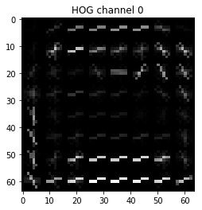


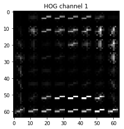


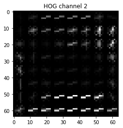


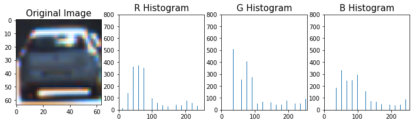


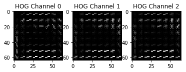


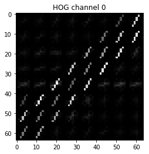


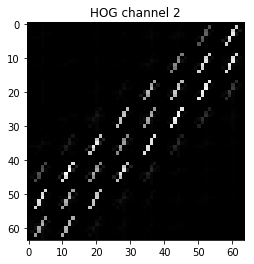


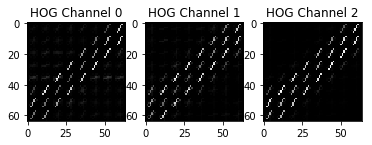


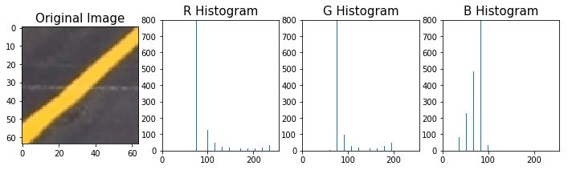


```python


test_images = glob.glob('test_images/*.jpg')
i=0
for image in test_images:
    img = mpimg.imread(image)
    b_boxes = find_cars(img, ystart, ystop, scale, svc, X_scaler, orient, pix_per_cell, cell_per_block, spatial_size, hist_bins)
    result = draw_boxes(img, b_boxes)
    plt.figure()
    plt.title("cars found")
    outfile = 'cars_with_boxes%s.png' % (i)
    plt.imshow(result)
    plt.show()
    #plt.savefig(outfile)
    i=i+1
   
    heat = np.zeros_like(img[:,:,0]).astype(np.float)

    add_heat(heat, b_boxes)

    heat = apply_threshold(heat,1)

    heatmap = np.clip(heat, 0, 255)

    labels = label(heatmap)
    draw_img = draw_labeled_bboxes(np.copy(img), labels)
    
    plt.figure()
    plt.subplot(121)
    plt.title("head map")
    plt.imshow(heat, cmap='hot')
    plt.subplot(122)
    plt.title("output image")
    plt.imshow(draw_img)
    outfile = 'outputfigure %s.png' % (i)
    #plt.savefig(outfile)
    plt.show()
    i=i+1

```

    C:\MyProgs\Conda\envs\carnd-term1\lib\site-packages\skimage\feature\_hog.py:119: skimage_deprecation: Default value of `block_norm`==`L1` is deprecated and will be changed to `L2-Hys` in v0.15
      'be changed to `L2-Hys` in v0.15', skimage_deprecation)
    


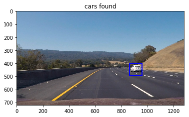


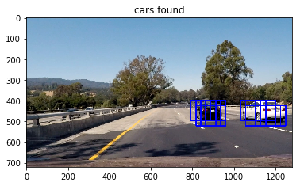


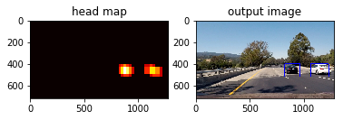


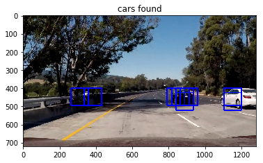


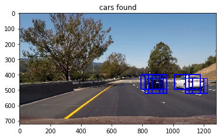


## Video Processing 


```python
def pipeline(image):
 
    b_boxes = find_cars(image, ystart, ystop, scale, svc, X_scaler, orient, pix_per_cell, cell_per_block, spatial_size, hist_bins)
    b_boxes_deque.append(b_boxes)

    heat = np.zeros_like(image[:,:,0]).astype(np.float)
    # Add heat to each box in box list
    add_heat_video(heat, b_boxes_deque)

    # Apply threshold to help remove false positives
    heat = apply_threshold(heat, heat_threshold)

    # Visualize the heatmap when displaying
    heatmap = np.clip(heat, 0, 255)

    # Find final boxes from heatmap using label function
    labels = label(heatmap)
    result = draw_labeled_bboxes(np.copy(image), labels)

    return result
```


```python
from moviepy.editor import VideoFileClip
from IPython.display import HTML


output_clip = 'test_video_out.mp4'

#clip1 = VideoFileClip("test_video.mp4")
clip1 = VideoFileClip("test_video.mp4")
vehicle_detect = clip1.fl_image(pipeline)
%time vehicle_detect.write_videofile(output_clip, audio=False)

```

    [MoviePy] >>>> Building video test_video_out.mp4
    [MoviePy] Writing video test_video_out.mp4
    

     97%|██████████████████████████████████████████████████████████████████████▏ | 38/39 [00:20<00:00,  1.80it/s]
    

    [MoviePy] Done.
    [MoviePy] >>>> Video ready: test_video_out.mp4 
    
    Wall time: 21.8 s
    


```python


output_clip = 'project_video_output.mp4'

#clip1 = VideoFileClip("test_video.mp4")
clip1 = VideoFileClip("project_video.mp4")
vehicle_detect = clip1.fl_image(pipeline)
%time vehicle_detect.write_videofile(output_clip, audio=False)

```

    [MoviePy] >>>> Building video project_video_output.mp4
    [MoviePy] Writing video project_video_output.mp4
    

    100%|███████████████████████████████████████████████████████████████████▉| 1260/1261 [11:19<00:00,  1.90it/s]
    

    [MoviePy] Done.
    [MoviePy] >>>> Video ready: project_video_output.mp4 
    
    Wall time: 11min 20s
    
