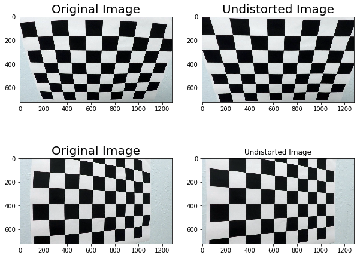
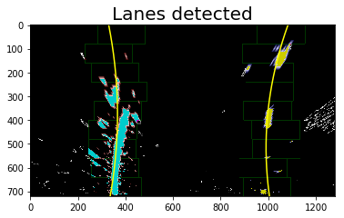

**Advanced Lane Finding Project**

The goals / steps of this project are the following:

* Compute the camera calibration matrix and distortion coefficients given a set of chessboard images.
* Apply a distortion correction to raw images.
* Use color transforms, gradients, etc., to create a thresholded binary image.
* Apply a perspective transform to rectify binary image ("birds-eye view").
* Detect lane pixels and fit to find the lane boundary.
* Determine the curvature of the lane and vehicle position with respect to center.
* Warp the detected lane boundaries back onto the original image.
* Output visual display of the lane boundaries and numerical estimation of lane curvature and vehicle position.

## [Rubric](https://review.udacity.com/#!/rubrics/571/view) Points

### Here I will consider the rubric points individually and describe how I addressed each point in my implementation.  

### Camera Calibration


I start by preparing "object points", which will be the (x, y, z) coordinates of the chessboard corners in the world. Here I am assuming the chessboard is fixed on the (x, y) plane at z=0, such that the object points are the same for each calibration image.  Thus, `objp` is just a replicated array of coordinates, and `objpoints` will be appended with a copy of it every time I successfully detect all chessboard corners in a test image.  `imgpoints` will be appended with the (x, y) pixel position of each of the corners in the image plane with each successful chessboard detection.


[//]: # (Image References)

[image0]: ./output_images/camera_distort.png "Camera Distortion"
[image1]: ./output_images/Original_Image.png "Original Image"
[image2]: ./output_images/Undist_Img.png "Undistorted"
[image3]: ./output_images/binary_warped.png "Binary Warped Image"
[image4]: ./output_images/color_threshold.png "Image with Color Threshold"
[image5]: ./output_images/warped_in_b.png "Warped Image Birds Eye View"
[image6]: ./output_images/result.png "Output"
[image7]: ./output_images/HLS.png "HLS color space"
[image8]: ./output_images/image_l.png "Image in L Space"
[image9]: ./output_images/image_sobel.png "Image with sobel filter"
[video1]: ./save.mp4 "Video"


```python
import cv2
import glob
from PIL import Image
import os
import numpy as np
import matplotlib.pyplot as plt
import matplotlib.image as mpimg
from ipywidgets import interact, interactive, fixed

global counter
global lane_left 
global lane_right
global mtx
global dist

```


```python
# read in images for camera calibration
file_path = os.getcwd() +  "\\"+"camera_cal"+ "\\"
images=glob.glob(file_path + "calibration*.jpg")

objpoints=[]
imgpoints=[]
nx = 9 # the number of inside corners in x
ny = 6 # the number of inside corners in y
objp = np.zeros((ny*nx,3), np.float32)
objp[:,:2] = np.mgrid[0:nx,0:ny].T.reshape(-1,2)

# find object points in chessboard iamge 
for image in images:
    img=cv2.imread(image)
    gray = cv2.cvtColor(img,cv2.COLOR_BGR2GRAY)
    ret, corners = cv2.findChessboardCorners(gray, (nx,ny), None)
    if ret==True:
        imgpoints.append(corners)
        objpoints.append(objp)
        img = cv2.drawChessboardCorners(img, (nx,ny), corners, ret)
img_size = (gray.shape[1], gray.shape[0])

# perform camera calibration to obtain the mtx matrix 
ret, mtx, dist, rvecs, tvecs = cv2.calibrateCamera(objpoints, imgpoints, img_size, None, None)
```

I then used the output `objpoints` and `imgpoints` to compute the camera calibration and distortion coefficients using the `cv2.calibrateCamera()` function.  I applied this distortion correction to the test image using the `cv2.undistort()` function. A comparision between the original image and the undistorted one is presented in the following picture：


```python
#Examples of undistorted chessboard image
%matplotlib inline
plt.figure(figsize=(10,8))

img = cv2.imread("camera_cal/calibration2.jpg")
img_undist = cv2.undistort(img, mtx, dist, None, mtx)
plt.subplot(2,2,1)
plt.title('Original Image', fontsize=20)
fig =plt.imshow(img)

plt.subplot(2,2,2)
plt.title('Undistorted Image', fontsize=20)
fig =plt.imshow(img_undist)


img = cv2.imread("camera_cal/calibration5.jpg")
img_undist = cv2.undistort(img, mtx, dist, None, mtx)
plt.subplot(2,2,3)
plt.title('Original Image', fontsize=20)
fig =plt.imshow(img)

plt.subplot(2,2,4)
plt.title('Undistorted Image')
fig =plt.imshow(img_undist)
plt.savefig('camera_distort.png')
```





To store some information about the lane in the previous running cycles and build up a history of the lane object, I created a class called Line and defined the two attributes "detected" and "last_poly_coeff". In the attribute "last_poly_coeff", the coefficients of the lane in the current picture is stored and used as a starting value of the next picture. As suggsted in the learning material, I also tried out using more attributes such as "best_fit" and "recent_xfitted", where I store  the polynomial coefficients averaged over the last n iterations, and the x values of the last n fits of the line. These Information can be used when the lane detected in the current picture largely differs from the previous experience value. 

When I first ran my image processing pipeline, the lane detection algorithm was working overall but the lanes are jumping sometimes, despite all the sanity checks I have added. It took me two days until I have detected that the error was already made during the camera calibration step. I have falsely put the camera calibration function inside the loop where I read in all the chessboard images for calibration. After I corrected this, The pipeline was working fine for the normal project video, even without any sanity checks. 


```python
# Define a class to receive the characteristics of each line detection
class Line():
    def __init__(self):
        # was the line detected in the last iteration?
        self.detected = False  
        #polynomial coefficients for the most recent fit
        self.last_poly_coeff = [np.array([False])]  
lane_left = Line()
lane_right = Line()
```


```python

```


```python
def unwarp(img, src, dst, M_warp):
    h,w = img.shape[:2]
    warped = cv2.warpPerspective(img, M_warp, (w,h), flags=cv2.INTER_LINEAR)
    return warped
```


```python
def sobel_x(img, sobel_kernel=3,min_thres = 20, max_thres =100):

    # convert image in rgb to hsl space
    img_hsl = cv2.cvtColor(img, cv2.COLOR_RGB2HLS)

    # taking the gradient in x and y direction 
    sobelx1 = cv2.Sobel(img_hsl[:,:,1], cv2.CV_64F, 1,0, ksize=sobel_kernel)
    sobelx2 = cv2.Sobel(img_hsl[:,:,2], cv2.CV_64F, 1,0, ksize=sobel_kernel)
        
    # scaling  
    sobelx1 = np.uint8(255*sobelx1/ np.max(sobelx1))
    sobelx2 = np.uint8(255*sobelx2/ np.max(sobelx2))

    # 5) Create a binary mask where mag thresholds are met
    binary_outputx1 = np.zeros_like(sobelx1)
    binary_outputx1[(sobelx1 >= min_thres) & (sobelx1 <= max_thres)] = 1

    binary_outputx2 = np.zeros_like(sobelx2)
    binary_outputx2[(sobelx2 >= min_thres) & (sobelx2 <= max_thres)] = 1

    binary_output = np.zeros_like(sobelx1)
    binary_output[(binary_outputx1 ==1) | (binary_outputx2 ==1)]=1
    # 6) Return this mask as your binary_output image
    return binary_output
```


```python
def create_output_img(undist,M_inv, warped, left_fit, right_fit):

    #create output image with lines detected
    warp_zero = np.zeros_like(warped).astype(np.uint8)
    image_warp = np.dstack((warp_zero, warp_zero, warp_zero))
    
    ploty = np.linspace(0, warped.shape[0]-1, warped.shape[0] )

    left_fitx = left_fit[0]*ploty**2+left_fit[1]*ploty+left_fit[2]
    right_fitx = right_fit[0]*ploty**2+right_fit[1]*ploty+right_fit[2]

    pts_left = np.array([np.transpose(np.vstack([left_fitx, ploty]))])
    pts_right = np.array([np.flipud(np.transpose(np.vstack([right_fitx, ploty])))])
    pts = np.hstack((pts_left, pts_right))

    # Draw the lane onto the warped blank image
    cv2.fillPoly(image_warp, np.int_([pts]), (255,215, 0))

    # Warp the blank back to original image space using inverse perspective matrix (Minv)
    warp_inv = cv2.warpPerspective(image_warp, M_inv, (image_warp.shape[1], image_warp.shape[0])) 

    # Combine the result with the original image
    img_out = cv2.addWeighted(undist, 1, warp_inv, 0.3, 0)
    return img_out
```


```python
def FindLanes(binary_warped):
    global counter
    global lane_left 
    global lane_right
    
    out_img = np.dstack((binary_warped, binary_warped, binary_warped))*255
    # creating histogram of the image for x axis
    histogram = np.sum(binary_warped[int(binary_warped.shape[0]/2):,:], axis=0)

       
    # find maximal value in the left and right half of the image histogram,
    # which most likely represent the position of the left and right lane.
    leftx_lane = np.argmax(histogram[:np.int(histogram.shape[0]/2)])
    rightx_lane = np.argmax(histogram[np.int(histogram.shape[0]/2):]) + np.int(histogram.shape[0]/2)

    nwindows = 9
    # Set height of windows
    window_height = np.int(binary_warped.shape[0]/nwindows)
    # Identify the x and y positions of all nonzero pixels in the image
    nonzero = binary_warped.nonzero()
    nonzeroy = np.array(nonzero[0])
    nonzerox = np.array(nonzero[1])

    # width of the searching windows 
    margin = 100
    # minimum number of pixels found in a window
    minpix = 50
    
    if counter>1:
        # if we already have a history of the lane, then we can recalculate basd on that history
        lft_poly=lane_left.last_poly_coeff
        rgt_poly= lane_right.last_poly_coeff
        left_lane_inds = ((nonzerox > (lft_poly[0]*(nonzeroy**2) + lft_poly[1]*nonzeroy + lft_poly[2] - margin)) & (nonzerox < (lft_poly[0]*(nonzeroy**2) + lft_poly[1]*nonzeroy + lft_poly[2] + margin))) 
        right_lane_inds = ((nonzerox > (rgt_poly[0]*(nonzeroy**2) + rgt_poly[1]*nonzeroy + rgt_poly[2] - margin)) & (nonzerox < (rgt_poly[0]*(nonzeroy**2) + rgt_poly[1]*nonzeroy + rgt_poly[2] + margin)))  
    else:
        left_lane_inds = []
        right_lane_inds = []
        for window in range(nwindows):

            win_y_low = int(binary_warped.shape[0] - (window+1)*window_height)
            win_y_high = int(binary_warped.shape[0] - window*window_height)
            win_xleft_low = int(leftx_lane - margin)
            win_xleft_high = int(leftx_lane + margin)
            win_xright_low = int(rightx_lane - margin)
            win_xright_high = int(rightx_lane + margin)
            # Draw the windows on the visualization image
            cv2.rectangle(out_img,(win_xleft_low,win_y_low),(win_xleft_high,win_y_high),(0,255,0), 2) 
            cv2.rectangle(out_img,(win_xright_low,win_y_low),(win_xright_high,win_y_high),(0,255,0), 2) 
            # Identify the nonzero pixels in x and y within the window
            good_left_inds = ((nonzeroy >= win_y_low) & (nonzeroy < win_y_high) & (nonzerox >= win_xleft_low) & (nonzerox < win_xleft_high)).nonzero()[0]
            good_right_inds = ((nonzeroy >= win_y_low) & (nonzeroy < win_y_high) & (nonzerox >= win_xright_low) & (nonzerox < win_xright_high)).nonzero()[0]
            # Append these indices to the lists
            left_lane_inds.append(good_left_inds)
            right_lane_inds.append(good_right_inds)
            # If you found > minpix pixels, recenter next window on their mean position
            if len(good_left_inds) > minpix:
                leftx_lane = np.int(np.mean(nonzerox[good_left_inds]))
            if len(good_right_inds) > minpix:        
                rightx_lane = np.int(np.mean(nonzerox[good_right_inds]))

        # Concatenate the arrays of indices
        left_lane_inds = np.concatenate(left_lane_inds)
        right_lane_inds = np.concatenate(right_lane_inds)

    # Extract left and right line pixel positions
    leftx = nonzerox[left_lane_inds]
    lefty = nonzeroy[left_lane_inds] 
    rightx = nonzerox[right_lane_inds]
    righty = nonzeroy[right_lane_inds] 

    # Fit a second order polynomial to each
    if len(leftx) == 0:
        left_fit =[]
    else:
        left_fit = np.polyfit(lefty, leftx, 2)
    
    if len(rightx) == 0:
        right_fit =[]
    else:
        right_fit = np.polyfit(righty, rightx, 2)

    lane_right.last_poly_coeff=right_fit
    lane_left.last_poly_coeff = left_fit  

 
    out_img[nonzeroy[left_lane_inds], nonzerox[left_lane_inds]] = [255, 0, 0]
    out_img[nonzeroy[right_lane_inds], nonzerox[right_lane_inds]] = [0, 0, 255]


    return left_fit, right_fit,out_img
```


```python
def display_result(binary_warped, left_fit,right_fit,out_img):

    ploty = np.linspace(0, binary_warped.shape[0]-1, binary_warped.shape[0] )
    left_fitx = left_fit[0]*ploty**2 + left_fit[1]*ploty + left_fit[2]
    right_fitx = right_fit[0]*ploty**2 + right_fit[1]*ploty + right_fit[2]

    #plt.figure(figsize=(30,20))
    #plt.subplot(2,1,1)
    plt.title("Binary Warped", fontsize=20)
    plt.imshow(binary_warped, cmap='gray')
    plt.savefig('binary_warped')

    #plt.subplot(2,1,2)
    binary_warped2 = np.zeros((720, 1280,3))
    binary_warped2[:,:,0] = binary_warped
    binary_warped2[:,:,1] = binary_warped
    binary_warped2[:,:,2] = binary_warped
    plt.plot(left_fitx, ploty, color='yellow')
    plt.plot(right_fitx, ploty, color='yellow')
    result = cv2.addWeighted(binary_warped2, .8, out_img, .8, 0)
    plt.title("Lanes detected", fontsize=20)
    plt.imshow(result)
    plt.savefig('result')
```


```python
def curvature(left_fit, right_fit, binary_warped):
    global lane_left 
    global lane_right
    ploty = np.linspace(0, binary_warped.shape[0]-1, binary_warped.shape[0] )
    y_eval = np.max(ploty)
    
    ym_per_pix = 30/720 # meters per pixel in y dimension
    xm_per_pix = 3.7/700 # meters per pixel in x dimension
    
    left_curv = ((1 + (2*left_fit[0]*y_eval*ym_per_pix + left_fit[1])**2)**1.5) / np.absolute(2*left_fit[0])
    right_curv = ((1 + (2*right_fit[0]*y_eval*ym_per_pix + right_fit[1])**2)**1.5) / np.absolute(2*right_fit[0])
    center = (((left_fit[0]*720**2+left_fit[1]*720+left_fit[2]) +(right_fit[0]*720**2+right_fit[1]*720+right_fit[2]) ) /2 - 750)*xm_per_pix
           


    return left_curv, right_curv, center
```


```python
def FindLaneInImage(ImgRGB, bVisualize=0):

    global counter
    global lane_left 
    global lane_right
    global mtx
    global dist
    
    
    Img_undistort = cv2.undistort(ImgRGB,mtx,dist,None,mtx)
    # Visualize undistortion
    if bVisualize ==1:
        plt.title('Original Image', fontsize=30)
        plt.imshow(ImgRGB)
        plt.savefig('Original_Image.png')
        plt.title('Undistorted Image', fontsize=30)
        plt.imshow(Img_undistort)
        plt.savefig('Undist_Img.png')
    h,w = Img_undistort.shape[:2]
    # define source and destination points for transform
    left_buttom = (200, 720)
    left_top=(585,450)
    right_buttom=(11,720)
    right_top=(695,450)

    src = np.float32([ left_top,
                      left_buttom, 
                      right_buttom, 
                      right_top])
    

    left_buttom = (320, 720)
    left_top=(320,0)
    right_buttom=(960,720)
    right_top=(960,0)
    dst = np.float32([left_top, left_buttom, right_buttom, right_top])
   

    M_warp = cv2.getPerspectiveTransform(src, dst)
    M_inv = cv2.getPerspectiveTransform(dst, src)

    Img_unwarp = unwarp(Img_undistort, src, dst,M_warp)

    # Visualize unwarp
    if bVisualize ==1:
        plt.title('Warped Image in Birdsview', fontsize=20)
        plt.imshow(Img_unwarp)
        plt.savefig('warped_in_b.png')
        
    image_hls= cv2.cvtColor(Img_undistort, cv2.COLOR_RGB2HSV)
    if(bVisualize ==1):
        plt.title('HSL Image in H Channel', fontsize=20)
        plt.imshow(image_hls[:,:,0],cmap ='gray')
        plt.savefig('image_h.png',cmap ='gray')
        plt.title('HSL Image in L Channel', fontsize=20)
        plt.imshow(image_hls[:,:,1],cmap ='gray')
        plt.savefig('image_l.png',cmap ='gray')
        plt.title('HSL Image in S Channel', fontsize=20)
        plt.imshow(image_hls[:,:,2],cmap ='gray')
        plt.savefig('image_s.png',cmap ='gray')
    
    binary_output_yellow = np.zeros((image_hls.shape[0], image_hls.shape[1]))
    binary_output_white = np.zeros((image_hls.shape[0], image_hls.shape[1]))
    
    binary_output_yellow[(image_hls[:,:,0] >= 0) & (image_hls[:,:,0] <= 50) & (image_hls[:,:,1] >= 100)  & (image_hls[:,:,1] <= 255)  & (image_hls[:,:,2] >= 100) & (image_hls[:,:,2] <= 255)] = 1
    binary_output_white[(image_hls[:,:,0] >= 18) & (image_hls[:,:,0] <= 255) & (image_hls[:,:,1] >= 0)  & (image_hls[:,:,1] <= 80)  & (image_hls[:,:,2] >= 180) & (image_hls[:,:,2] <= 255)] = 1

    img_color_thresh =np.zeros_like(binary_output_yellow)
    img_color_thresh[(binary_output_yellow==1) | (binary_output_white==1)] =1
    img_sobelx_thresh = sobel_x(Img_undistort,9,80,220) 
    if(bVisualize ==1):
        plt.title('Image with sobelx filter', fontsize=20)
        plt.imshow(img_sobelx_thresh,cmap ='gray')
        plt.savefig('image_h.png',cmap ='gray')
        
    img_thresh =np.zeros_like(binary_output_yellow)
    img_thresh[(binary_output_yellow==1) | (binary_output_white==1) | (img_sobelx_thresh==1)] =1
    binary_warped = cv2.warpPerspective(img_thresh, M_warp, (w,h), flags=cv2.INTER_LINEAR)

    if bVisualize == 1:
        plt.title('Image with color threshold', fontsize=20)
        plt.imshow(img_color_thresh,cmap ='gray')
        plt.savefig('color_threshold.png')
        plt.title('Warped Image with threshold', fontsize=20)
        plt.imshow(binary_warped,cmap ='gray')
        plt.savefig('warped_image.png')
        

    left_fit, right_fit, out_img  = FindLanes(binary_warped)
    if bVisualize == 1:
        display_result(binary_warped, left_fit,right_fit,out_img)
        
  
    left_curv, right_curv, center_off = curvature(left_fit, right_fit, binary_warped)
    
        #Warp back to original and merge with image    
    img_out = create_output_img(Img_undistort, M_inv, binary_warped,left_fit, right_fit)

    #Write curvature and center in image
    TextL = "Left curv: " + str(int(left_curv)) + " m"
    TextR = "Right curv: " + str(int(right_curv))+ " m"
    TextC = "Center offset: " + str(round( center_off,2)) + "m"
    fontScale=1
    thickness=2
    
    fontScale = cv2.FONT_HERSHEY_SIMPLEX
    cv2.putText(img_out,TextL,(10,100),  fontScale, 2,(255,255,255),2,cv2.LINE_AA)
    cv2.putText(img_out,TextR,(20,200),  fontScale, 2,(255,255,255),2,cv2.LINE_AA)
    cv2.putText(img_out,TextC,(30,300),  fontScale, 2,(255,255,255),2,cv2.LINE_AA)

    counter = counter+1
    return img_out
```

To demonstrate this step, I will describe how I apply the distortion correction to one of the test images like this one:
![alt text][image1]


```python
image_path='./test_images/test1.jpg'
ImgBGR = cv2.imread(image_path)
ImgRGB = cv2.cvtColor(ImgBGR, cv2.COLOR_BGR2RGB)
bVisualize=1
counter=0
FindLaneInImage(ImgRGB, bVisualize)
```


    array([[[ 97, 153, 200],
            [ 97, 153, 200],
            [ 97, 153, 200],
            ..., 
            [ 88, 150, 197],
            [ 87, 149, 196],
            [ 85, 147, 194]],
    
           [[ 98, 154, 201],
            [ 97, 153, 200],
            [ 97, 153, 200],
            ..., 
            [ 87, 149, 196],
            [ 86, 148, 195],
            [ 85, 147, 194]],
    
           [[ 98, 154, 201],
            [ 98, 154, 201],
            [ 98, 154, 201],
            ..., 
            [ 87, 149, 196],
            [ 86, 148, 195],
            [ 86, 148, 195]],
    
           ..., 
           [[103,  89, 104],
            [104,  90, 104],
            [105,  91, 105],
            ..., 
            [126, 107, 100],
            [127, 108, 101],
            [123, 104,  97]],
    
           [[105,  91, 103],
            [106,  92, 104],
            [107,  92, 105],
            ..., 
            [125, 106,  99],
            [125, 106,  99],
            [123, 104,  97]],
    
           [[110,  94, 105],
            [110,  94, 105],
            [110,  94, 104],
            ..., 
            [126, 107, 100],
            [126, 107, 100],
            [125, 107, 100]]], dtype=uint8)





```python
# Import everything needed to edit/save/watch video clips
from moviepy.editor import VideoFileClip
from IPython.display import HTML
import moviepy as mve
```


```python
#Create video file pipeline
counter=0


output = '2010.mp4'
clip1 = VideoFileClip("project_video.mp4").subclip(0,2)

out_clip = clip1.fl_image(FindLaneInImage) #NOTE: this function expects color images!!
%time out_clip.write_videofile(output, audio=False)
print(counter)


```

    [MoviePy] >>>> Building video 2010.mp4
    [MoviePy] Writing video 2010.mp4
    

     98%|██████████████████████████████████████████████████████████████████████▌ | 50/51 [00:10<00:00,  4.40it/s]
    

    [MoviePy] Done.
    [MoviePy] >>>> Video ready: 2010.mp4 
    
    Wall time: 11.9 s
    51
    


```python
from IPython.display import HTML
HTML("""
<video  width="960" height="540" controls>
  <source src="{0}">
</video>
""".format(output))
```


<video  width="960" height="540" controls>
  <source src="2010.mp4">
</video>


```python

```


```python

```


```python

```


```python

```


```python

```


```python

```


```python

```
